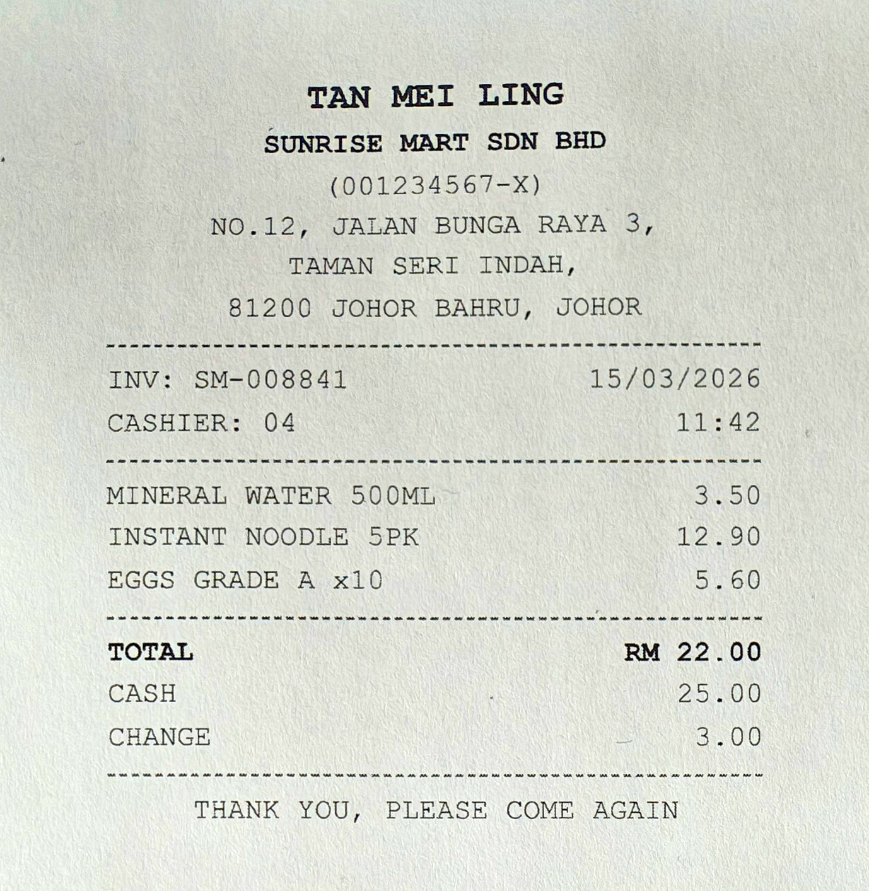
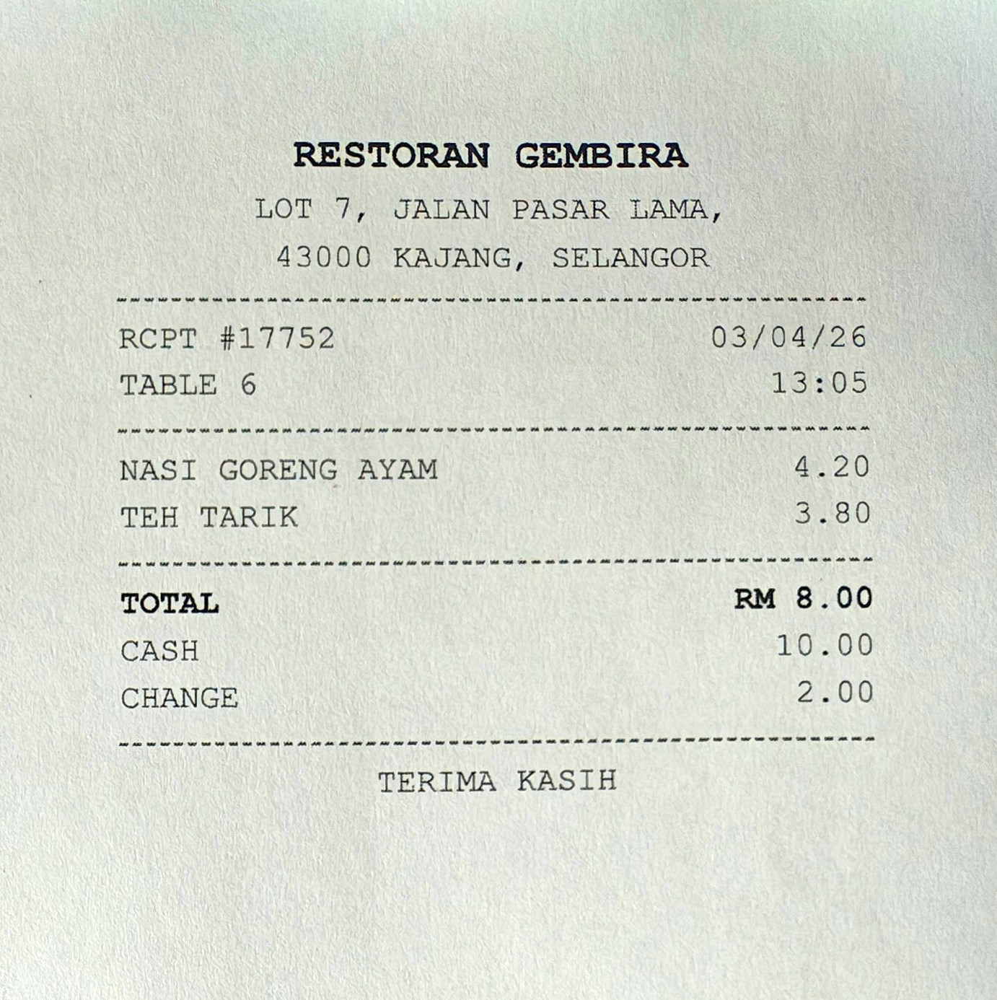
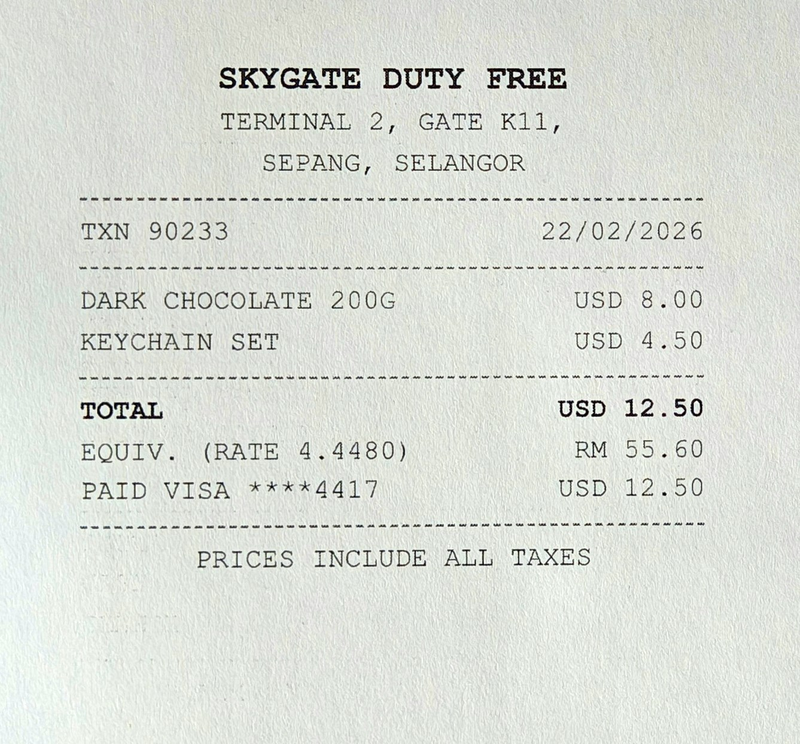
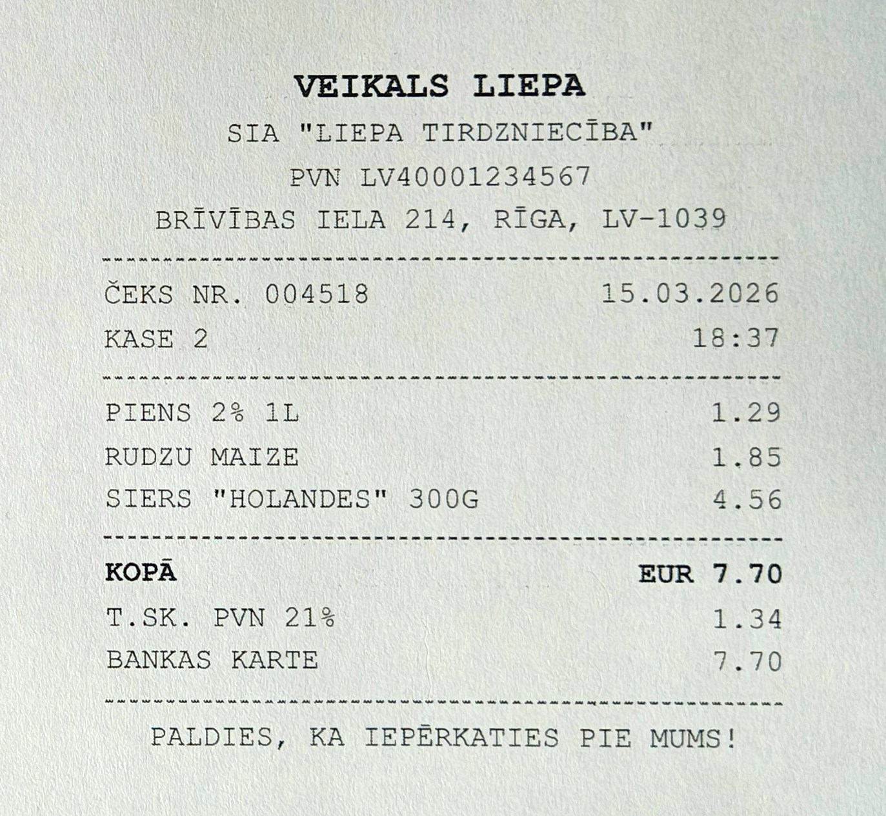
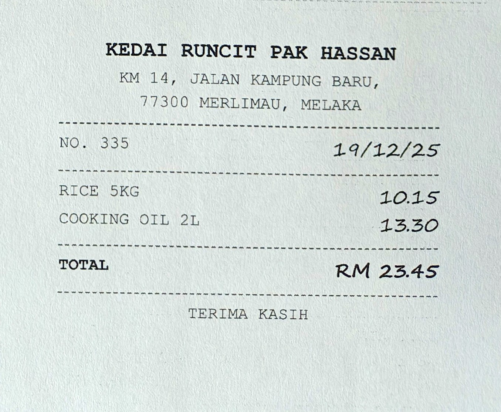

# DocExtract

An LLM document-extraction pipeline that publishes its own report card. Receipts and
invoices go in; validated, typed JSON comes out; the corpus that builds answers questions
with checked citations. Every table in this README — extraction, retrieval, and the failure
counts alike — is regenerated from stored eval runs by `docextract report`, never
hand-edited; the prose around them cites those stored runs and is written by hand.

Most extraction demos show a cherry-picked success. This project inverts that: a cheap model
does the reading, a deterministic validator decides what can be trusted, an eval harness
measures field-level accuracy against public ground truth, retrieval over the results is
scored the same way, and the failures get counted and categorized instead of cropped out.

## How it works

```
 receipt image / PDF
        │
        ▼
 vision extraction ──── Claude Haiku, headless CLI, Read tool only;
        │               per-field self-reported confidence
        │               └─ output unparseable? one retry, billed and logged
        ▼
 deterministic validation ── dates parse, totals positive, currency whitelist,
        │                    line items sum to total, confidence floor —
        │                    the LLM never grades its own output
        ├── all rules pass ──────────► extractions/accepted/
        └── any violation ──────────► extractions/needs-review/  (violations listed)
        │
        ▼
 eval harness ── field accuracy + exact match vs. SROIE ground truth;
        │        failed docs feed a targeted escalation pass (stronger model,
        │        only where measured accuracy says it pays)
        ▼
 report ── results + failure-count tables below, month-to-date cost vs. a hard budget

 the accepted artifacts are also a corpus:

 lexical retrieval ── BM25 in-repo, $0/query, one receipt per document
        │             └─ optional query rewrite / rerank, kept only if measured
        ▼
 answer + groundedness ── cite doc IDs; citations must be in context and the
                          figure must match ground truth — all checked in code
```

Every LLM call is cost-logged to an append-only ledger. Extraction stops scheduling new
calls when month-to-date spend reaches the budget — the cap is enforced by code, not by
intention.

### When a call comes back wrong

Models sometimes answer a "return JSON" instruction with prose, or with JSON wrapped in
apology. That is a transport-shaped failure, not a data-shaped one, so it is retried once
with the required shape restated — and the retry is visible from three sides: the artifact
records `attempts: 2` and the exact parse error it recovered from, the ledger gets a second
line under `extract:retry`, and the document's cost is the sum of both calls. `report` prints
the month's retry rate and what retries cost.

Two rules keep this from becoming a way to launder bad output. The retry limit is bounded
(`ClaudeCli:MaxAttempts`, default 2, hard-clamped at 3) because an unbounded loop on a paid
call is a runaway bill, not resilience. And a retry only decides whether a document was
*read* — never whether the reading was *right*. That verdict stays with the deterministic
validator, which the retry never re-runs, relaxes, or gets a second opinion from. A document
that fails both attempts lands in `needs-review` with both attempts charged for.

`scripts/stub-claude-cli.cmd` is a CLI test double that fails on demand, so the recovery path
can be exercised without waiting for a real model to misbehave.

## Results

Field-level accuracy against the [SROIE](https://rrc.cvc.uab.es/?ch=13) (ICDAR 2019) ground
truth; comparison is normalization-tolerant (case, whitespace, punctuation, date formats), so
the numbers measure reading rather than formatting luck.

The third row is not a third extraction. It is the second one re-scored after a bug was found
in the date comparator, which had been failing to normalize compact all-digit keys like
`20180304` and counting a correct reading as a miss. Fixing it moved date from 98.8% to 99.6%
and exact match from 72.8% to 73.2%; no other column moved, and no model was called, because
scoring reads artifacts already on disk. Both rows are kept rather than the old one being
quietly overwritten — a report card that edits its own history is worth less than one that
shows the correction. The first row cannot be re-scored: escalation overwrote the artifacts it
replaced, so the haiku-only state no longer exists on disk and its date column carries the
same pessimism, uncorrected.

<!-- eval-results:begin -->
| Run | Models | Docs | Company | Date | Address | Total | Exact match | Cost | $/doc | Avg s/doc |
|---|---|---|---|---|---|---|---|---|---|---|
| haiku-250 | claude-haiku-4-5 | 250 | 74.4% | 76.4% | 66.3% | 92.0% | 42.4% | $8.99 | $0.036 | 18.8 |
| haiku+escalation-250 | claude-haiku-4-5+claude-sonnet-5 | 250 | 86.0% | 98.8% | 85.5% | 98.4% | 72.8% | $20.14 | $0.081 | 15.6 |
| haiku+escalation-250-rescored | claude-haiku-4-5+claude-sonnet-5 | 250 | 86.0% | 99.6% | 85.5% | 98.4% | 73.2% | $20.14 | $0.081 | 15.6 |
<!-- eval-results:end -->

Line-item extraction exists in the schema but is not scored here: SROIE's ground truth has
no line items. Scoring it against [CORD](https://github.com/clovaai/cord) (CC BY 4.0,
Indonesian receipts) is the natural extension.

### What the failures actually look like

The columns above are aggregates, and an aggregate hides the shape of its errors. The same
runs, counted as documents rather than rates:

<!-- miss-counts:begin -->
| Run | Company | Date | Address | Total |
|---|---|---|---|---|
| haiku-250 | 64 of 250 | 59 of 250 | 84 of 249 | 20 of 249 |
| haiku+escalation-250 | 35 of 250 | 3 of 250 | 36 of 249 | 4 of 249 |
| haiku+escalation-250-rescored | 35 of 250 | 1 of 250 | 36 of 249 | 4 of 249 |
<!-- miss-counts:end -->

Reading the surviving mismatches is more instructive than the totals, because a large share
of them are not misreadings at all.

**Company misses are mostly disagreements about which name is the company.** The model
returns `Three Stooges Bistro & Cafe` where the key says `THREE STOOGES`, keeps the
registration number in `99 SPEED MART S/B (519537-X)`, and prefers the trading name
`Brewery Tap` over the printed legal owner. Receipts routinely carry three or four candidate
entities — brand, legal entity, parent company, mall tenant — and the field's boundary is a
convention the key encodes but the receipt does not.

**Address misses include cases where the model is right and the key is wrong.** Against
`SEITA ALAM ... SHAN ALAM` the model returns `SETIA ALAM ... SHAH ALAM`, and against
`BATANG BEJUNTAL` it returns `BATANG BERJUNTAI` — matching the real place names in both
cases, and scored as a miss for it. Others turn on trailing store codes the key carries and
the receipt body does not, like `SITE 1066`. Genuine misreads exist too, such as
`JALAN ANGSA` read as `JALAN MASA`, but the address column understates reading quality by
some margin.

**Dates are down to a single genuine miss, and finding it was a lesson about the harness.**
Reading the mismatches showed two of the three were the comparator rather than the model: the
keys `20180304` and `25032018` were being compared against `2018-03-04` and `2018-03-25` —
the same dates in a form the parser did not accept. The fix is the `-rescored` row. It is
worth being precise about why that was safe to change: the correction is right on its own
terms, since those strings denote the same day whichever way the score moves, and a rule
answerable without looking at the result is one that motivated reasoning cannot bend. A
comparator adjusted because it *raised* the number would be worth nothing.

**Totals fail by cents when they fail.** Two of the four are `112.45` read as `112.46` and
`72.93` read as `72.95` — digit-level slips on a field that otherwise survives at the top of
the table.

The six receipts below isolate these categories one per image, so the error modes are
inspectable rather than merely counted. They sit outside the scored corpus and change none of
its numbers. Every one is fictitious and self-made — invented businesses, people, and
registration numbers — because the corpus the numbers come from cannot be redistributed here.
Each was printed and photographed rather than
screenshotted: the capture carries paper grain, ink bleed into the fibre, and the softening
of small type, which is the kind of input the extractor actually receives. Sources and the
print sheet are in [`synthetic/`](synthetic/).

| | |
|---|---|
|  | **A person's name set above the business.** The largest, boldest line is a person, not the merchant. Visual prominence invites being read as importance, which makes the name the attractive wrong answer for `company`. |
|  | **`03/04/26` — 3 April or 4 March?** Nothing on the receipt disambiguates, so the model has to guess a locale. Normalization-tolerant comparison forgives formats, not a wrong guess. |
|  | **Two currencies, one total.** `USD 12.50` is the amount charged; `RM 55.60` is the same money in another unit. Reaching for the larger figure, or for the local one, both yield a wrong `total`. |
|  | **Latvian, with `KOPĀ` for total and `PVN` for VAT.** No English anchor words. The layout is legible and the labels are not, which separates reading text from knowing which field it names. |
|  | **Items sum to 15.70; the printed total says 18.70.** Not a model error. The deterministic validator catches the arithmetic and routes the document to `needs-review` even when every field was read correctly. |
|  | **Amounts written by hand over printed labels.** The stroke shapes are where digit confusion lives, and the total is the field least able to absorb it. |

Running all six through the same Haiku-first pipeline cost $0.27. Three traps sprang and
three did not, and the split is more interesting than the count.

The person-name receipt failed as designed: `vendor` came back `TAN MEI LING` — the cashier —
at 0.95 confidence, and the document was **accepted**. A wrong name is a well-formed string,
and no deterministic rule can tell it from a right one.

The date trap sprang twice, once by accident. `03/04/26` was read as 4 March instead of
3 April; and `08/01/2026`, on the sum-mismatch receipt that was never built to test dates,
was read as 1 August instead of 8 January. Both flips went month-first. The other four
receipts happen to carry a day above 12, where the ordering cannot be mistaken, and all four
were read correctly. So the failure is not digit misreading — it is defaulting to US ordering
wherever the receipt allows it, which is a different bug with a different fix.

Self-reported confidence caught one of those two. The `03/04/26` date came back at 0.60
against 0.95 everywhere else, landing on the `MinFieldConfidence` floor exactly. The
`08/01/2026` flip carried 0.95 and signalled nothing.

The three traps that did not spring: multi-currency picked `USD 12.50` over the `RM 55.60`
conversion line; the Latvian receipt gave vendor, date, total, currency and the 21% `PVN` tax
correctly with no English anchor words; and the handwritten amounts were read exactly,
including the `23.45` total. One incidental slip — a line item read `SIERS "HOILANDES"` for
`SIERS "HOLANDES"`.

The validator's behaviour here is the part worth sitting with. Exactly one document was held
for review — the sum-mismatch receipt, on arithmetic — and it is the one receipt where the
model read every field correctly. The two receipts carrying real field errors were both
accepted. Structural checks catch structural faults; semantic errors are invisible to them,
which is precisely why accuracy is measured against ground truth instead of inferred from the
review split.

Six receipts is an anecdote, not a rate, and these were printed cleanly and shot straight-on,
making them easier than the scanned corpus. Nothing here revises the table above; it shows
what the table's misses are made of.

## Asking the corpus questions

Extraction produces a corpus, and the next thing anyone wants is to ask it something. This
slice adds retrieval and question answering over the artifacts already on disk — no
re-extraction, no vector database, no embedding provider. Receipts are short, so one receipt
is one document and the baseline is a BM25 index that lives in this repository. It costs $0
per query, which is the point: an improvement has to beat free before it earns its API calls.

The questions are derived mechanically from the SROIE ground truth — never hand-written, never
model-written. Single-receipt lookups use (vendor, date) pairs that identify exactly one
receipt; aggregates cover every receipt the ground truth attributes to one vendor. A question
is only emitted when its relevant-document set is provably complete, because a relevant set
that is merely probable silently caps recall and looks like a retriever problem.

The index is built from what the extractor produced, not from the answer key. A receipt whose
vendor was misread is genuinely hard to find by vendor name, and indexing the ground truth
instead would hide that behind numbers that no longer describe the system anyone would run.

The question set is derived once and then **pinned to disk**, and the reason is a trap this
project walked into. Questions come from ground-truth keys, and a key whose date will not
parse is dropped. So when the date comparator was fixed above, three more keys became
parseable, the generated set changed, and baseline recall@1 moved from 72.1% to 73.7% —
without one line of the retriever changing. Recall figures are only comparable against a
fixed set of questions, so the set is now an input rather than a by-product: it is written
once and reused until somebody deletes the file deliberately. The cost of that choice is
recorded honestly — the pinned set was derived before the comparator fix and so omits three
receipts it would now admit.

<!-- retrieval-results:begin -->
| Run | Pipeline | Docs | Questions | Recall@1 | Recall@5 | Recall@10 | MRR | Grounded | Cost |
|---|---|---|---|---|---|---|---|---|---|
| bm25-baseline | bm25 | 250 | 30 | 72.1% | 94.7% | 98.0% | 0.922 | n/a | $0.0000 |
| bm25 | bm25 | 250 | 30 | 72.1% | 94.7% | 98.0% | 0.922 | 28/30 | $0.7507 |
| bm25+rerank | bm25+rerank | 250 | 30 | 78.4% | 98.0% | 98.0% | 1.000 | 29/30 | $1.6889 |
<!-- retrieval-results:end -->

Read that with the scale in mind: 30 questions over 250 documents is a demo, not a benchmark.

The first row is the same retrieval as the second, scored without generating any answers. Its
cost column is the honest version of "retrieval is free": identical recall for $0.0000, which
locates every cent of the other two rows in answer generation rather than in search.

**The reranker was kept because the numbers asked for it, not because it sounded good.** It
moves recall@1 from 72.1% to 78.4%, recall@5 from 94.7% to 98.0%, and MRR from 0.922 to 1.000
— a relevant receipt is now ranked first for every question in the set, and single-receipt
lookups reach 100% at rank 1. It also converts one ungrounded answer into a grounded one, by
pulling a receipt into the top-5 context that the lexical pass had left at rank 6. Had these
columns not moved, the honest write-up would have been that a 98%-recall@10 baseline did not
need fixing.

What it costs is the other half of that sentence: reranking more than doubles the bill, from
$0.75 to $1.69, because it adds a model call per question to reorder documents the free pass
had already found. On this corpus that buys ranking quality, not reach.

Two things the table does not say on its own. Recall@1 is bounded above for aggregate
questions — one with three relevant receipts cannot beat 0.33 at k=1 — so the k=5 and k=10
columns are the ones to compare across pipelines. And reranking only permutes candidates the
lexical pass already found, so it can move recall@1, recall@5 and MRR, but recall@10 is fixed
by the baseline no matter how good the reranker is. That is visible in the table rather than
merely asserted: recall@10 is 98.0% in both pipelines, to the decimal.

### Groundedness is a check, not an opinion

An answer is scored by three deterministic predicates, not by asking a model whether it did
well:

1. it cites at least one document ID;
2. every cited ID is a document that was actually in its context — a citation it was never
   shown is fabricated provenance, which is worse than no citation at all;
3. the figure it reports equals the ground-truth figure.

An LLM judge would have been fewer lines and worth nothing here, because it would share the
failure modes of the thing under test.

That third predicate is not redundant, and one recorded failure shows why. On an aggregate
question the top-ranked receipt was relevant, but only two of the five receipts that belonged
in the answer made it into the top-5 context. The model then did exactly what it was asked:
it summed what it was shown, and reported $39.70 against a true $102.10. Every citation it
gave was a document it had actually been shown, so **a citation-only groundedness check would
have passed this answer**. Only comparing the figure to ground truth caught it.

The second recorded failure is the encouraging one. With nothing relevant in its context at
all, the model returned no figure rather than inventing a plausible one.

Both failures are aggregate questions, and both are retrieval failures that surfaced
downstream — the answering step was faithful to its context in each case. That is the argument
for measuring retrieval separately instead of judging the final answer alone: an
answer-only metric would have blamed the wrong component.

## Datasets and licensing

No dataset files are committed to this repository. SROIE's original license terms are
unclear (community mirrors relicense only annotations), and while CORD is CC BY 4.0, the
posture is uniform: `scripts/download-datasets.ps1` fetches everything locally. Every
receipt image in this README is a self-made synthetic one from [`synthetic/`](synthetic/);
no scored document is reproduced.

## Running it

```powershell
dotnet build DocExtract.slnx
dotnet run --project DocExtract/DocExtract.csproj -- <verb>

# verbs:
#   extract <file|dir|list.txt> [--parallel N] [--tier extraction|escalation] [--limit N]
#   eval [--label NAME]      score extraction artifacts against ground truth
#   eval --retrieval [--questions N] [--k N] [--rewrite] [--rerank] [--no-answers]
#                            recall@k / MRR / groundedness over the artifacts already
#                            extracted; --no-answers is the $0 retrieval-only pass
#   report                   results tables (regenerates the blocks above) + cost vs budget
#   check                    config smoke check (reports key presence only)
```

Configuration layers: `appsettings.json` (committed, non-secret defaults) →
`appsettings.Development.json` (gitignored) → environment variables.

## Honest limitations

- Company names and addresses are scored with normalization-tolerant exact match; a model
  reading "SDN BHD" where the receipt prints "SDN. BHD." ties, but a paraphrase does not —
  near-misses count as misses.
- The `haiku-250` row is scored with the pre-fix date comparator and cannot be corrected:
  escalation overwrote the artifacts it replaced, so there is nothing left on disk to
  re-score. Its date column is pessimistic by an unknown margin, and the two rows are
  therefore not scored identically — compare the `-rescored` row against nothing but itself.
- The retrieval question set is pinned rather than re-derived on every run. It has to be:
  questions are built from ground-truth keys, keys that fail to parse are dropped, and the
  date fix above made three more of them parseable — which silently changed which questions
  existed and moved baseline recall@1 by 1.6 points without the retriever changing at all. A
  yardstick that moves when the thing beside it is repaired cannot measure the repair.
- The validator's needs-review flags are conservative by design: a receipt with a service
  charge can fail the line-items-sum rule while every extracted field is correct.
- Confidence values are the model's self-assessment. They gate the review split; they are
  deliberately not used by the eval, which trusts only ground truth.
- Scanned-receipt quality varies wildly; the failure examples recorded per eval run are the
  actual error surface, not a curated subset.
- Retrieval is scored over 30 questions and 250 documents. That is enough to rank two
  pipelines against each other and not enough to publish as a benchmark; treat the deltas as
  directional and the absolute numbers as a demo.
- Aggregate questions are capped at five relevant receipts per vendor. Larger fan-outs would
  measure how skewed the corpus is more than how well retrieval works.
- Cost figures come from the headless CLI, which charges a fixed per-invocation overhead —
  measured at ~$0.018 before a single prompt token — on top of tokens. A retrieval answer here
  costs ~$0.025, of which roughly three quarters is that floor rather than the prompt. Read
  the cost column as the price of this delivery mechanism, not as raw API token pricing.
- The published results table predates the retry path, so those numbers include no retried
  documents. Retry recovers malformed *responses*, not misread *fields* — the accuracy columns
  would move only for documents lost to unparseable output, and the table was not re-run to
  claim that, because re-extracting a scored corpus to chase a rounding difference is exactly
  the kind of spend the budget exists to refuse.

## Colophon

Built with Claude Code as the delivery engine; the architecture, validation rules, eval
design, and every review decision are mine. .NET 8, C#, headless Claude CLI, JSONL storage.
